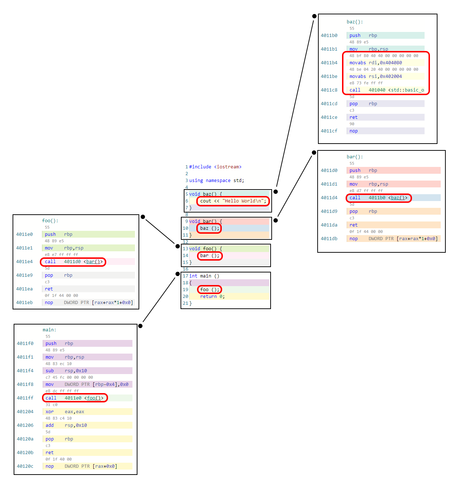

:information_source: Medium level

# Tutorial: efficient call-stack capturing

This tutorial will teach us what is a call stack and how we it can help us debug our applications in a way that is at the same time efficient and does not interfere too much with our application duties. It focuses on Windows platform, however, it could easily be adapted to any platform (TODO).

## But first, what is a call stack?

A call stack is a sequence of memory addresses that represent the sequence of active subroutines that are being executed at the moment. Consider the following really simple program in the centre of the image:


When our program is being executed at line 6

This very simple program is translated to assembly code as we can see in the boxes around 

If we captured the call stack **in line 2**, we would get a series of memory addresses. Starting by the current execution point (address corresponding to line 2) Each of them represent it would be a sequence of memory return addresses. This means that after the execution of *baz* it will return the control to  corresponding with this particular source code at lines 2 (the current instruction pointer), 7 (right after the call) and 11 (right after the call as well) in that order. the 2, 7 and 11 numbers are what we want to see but internally they are represented by memory addresses.

## How a process is organized

As we just said, a call stack is made out of process memory addresses. But how are these memory locations really organized inside a process? 

Briefly, as this is not the aim of this tutorial, in Windows a process is made out of at least one [module](https://learn.microsoft.com/en-us/windows/win32/psapi/module-information) (The *.exe*). Each module has an address inside the process address space and a size. A process is just a bunch of memory ranges in the end and all the call stack entries belong to one and only one of this ranges.

Let's imagine a process with 4 modules: _**A**_, _**B**_, _**C**_ and _**D**_. In the picture we represent the process memory space range (*0*, *N-1*) and visually each module 


Notice that they do not necessarily need to be contiguous. It will depend not only on the OS but the application logic as some of these modules will surely be loaded programmatically following some application logic. In this particular case there is a file (*foo.cpp*) that contains code. All if it is between the boundaries for ***B*** space address. In particular there is a piece of code that is represented


This helps hugely us when we are debugging our code or when crashes happen as we can track back the series of calls that led to a particular point in the code.

One of the most obvious use cases is **when an exception happens** in our application that prevents the application from continuing to run. In those unfortunately common situations, we usually store the call stack along with other information such as a minidump so we can inspect later the issue.

The call stack is just a **bunch of addresses** that we need to **transform into modules/files/lines** in order to be useful for engineers. This translation is usually done inside the application that crashed in the first place, inside the exception-handling routine. 

This is a **time-consuming process** as it implies loading the symbols associated with each of the modules of each of the addresses from the call stack. In addition, most of the functions in the [*DbgHelp*](https://learn.microsoft.com/en-us/windows/win32/api/dbghelp/) library (Which we need to use) are not thread safe making it **unusable for multithreaded applications**. Nevertheless, in the most common case mentioned above, it is a price we can pay as the application will not continue running.

Now, there are **other use cases** that could benefit from faster call-stack capturing that do not require the application to stop running. For instance, we could have code *ensures* that verifies some assumptions that upon not being met could trigger some call-stack capturing event useful for debugging. Another usage case is tracking memory usage without having to create complex tagging systems that require modifications in the code.

This tutorial describes a way to capture raw call stacks and do the translation into module/file/line **in a different application**. This follows some *minimum-intervention-principle* that is good for performance and for not determining or bloating the host application code as well.

> Notice that this tutorial is based on Windows platform, however, the same principles can be applied to other platforms

## The common case

As I mentioned before, **the most common case** is when an exception is raised and our application cannot continue running. In this particular case, we need to access the call stack. There are mainly two ways to do so:

1. By using the function ***[StackWalk64](https://learn.microsoft.com/en-us/windows/win32/api/dbghelp/nf-dbghelp-stackwalk64)***

   Given a *[CONTEXT](https://learn.microsoft.com/en-us/windows/win32/api/winnt/ns-winnt-arm64_nt_context)* (for instance from the exception information as in *[EXCEPTION_POINTERS](https://learn.microsoft.com/en-us/windows/win32/api/winnt/ns-winnt-exception_pointers)* or from the function *[RtlCaptureContext](https://learn.microsoft.com/en-us/windows/win32/api/winnt/nf-winnt-rtlcapturecontext)*), this function will return information of the next entry in the call stack. Then we use the functions in [*DbgHelp*](https://learn.microsoft.com/en-us/windows/win32/api/dbghelp/) library that allow us to translate addresses into symbols, lines, etc.

2. By directly accessing the call stack via ***[CaptureStackBackTrace](https://learn.microsoft.com/en-us/windows/win32/debug/capturestackbacktrace)*** 

   Unlike *StackWalk64*, this retrieves up to a certain depth at once.

In all cases, we need to deal with symbol library by initializing it, loading symbols and lines or even function parameters. All this has a price obviously. 

## The fast way

The fast way is obvious, just capture entries and store them for later resolution. Before we continue, we need to understand better how a process memory is organized.

It is not really the purpose of this tutorial but, very briefly: a process is made out of [modules](https://learn.microsoft.com/en-us/windows/win32/psapi/module-information) (At least 1; the .exe). Each module has its base memory address and a size. All modules are a collection of memory ranges and any item in a call stack belongs to one of the modules.

Check out the picture where a process has 4 modules ***A***, ***B***, ***C*** and ***D***. When the compiler generates debug information for a module, it includes all the lines in the code Inside the module ***B*** there are symbols like functions and others and is an address associated to the module **B** that corresponds with the line **42** in the file ***foo.cpp***. When we retrieve a call stack the addresses are relative to the process address space: ***Abs Addr*** in our case. With respect to the module it is ***Rel Addr***.

:information_source: Precisely, ***Rel Addr*** is what we are looking for!


The reason is that we do not control how nor when applications load modules. Some start with the application and others are loaded on demand by the program. In addition, OS use [ASLR](https://en.wikipedia.org/wiki/Address_space_layout_randomization) as a security measure. 

So, we need to convert those absolute addresses to relative ones. 

Following the minimum-intervention aim, we cannot iterate over all the call-stack items and resolve the module information for each address. That would be prohibitively costly. Instead, we will be tracking the loading and unloading of modules, keeping a database of module information that will allow us to compute the relative paths later. 

This tracking has two steps

Remember that we wanted to resolve all this in a separate application? We cannot guarantee that all the modules are going to be in the same relative position once we load them again. An application can decide to load a module in different orders according to a logic that is different each time it is executed. What we need is all the addresses to have as a reference the base module address.

```c++
namespace qcstudio::callstack_tracker {

    using namespace std;

    /*
        Callback params...

        bool:      true if load false if unload
        wstring:   full path of the dll
        wstring:   name of the dll
        uintptr_t: base address of the dll
        size_t:    size of the dll
    */

    using callback_t = function<void(bool, const wstring&, const wstring&, uintptr_t, size_t)>;

    // start / stop

    bool start(callback_t&& _callback);
    void stop();

}  // namespace qcstudio::dll_tracker
```

Let's talk about implementation details for Windows.

## Conclussions


:warning:A  watning

