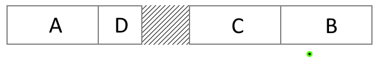
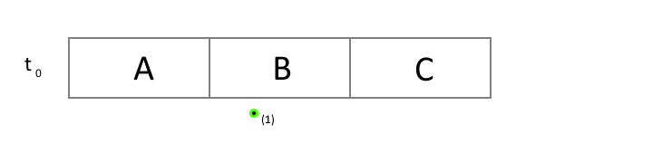
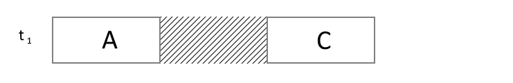
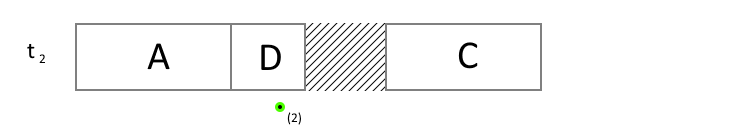
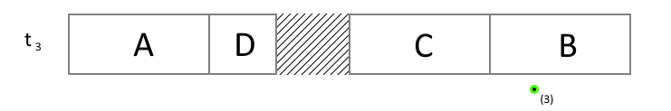

:information_source: Medium level

# Tutorial: efficient call-stack tracking

>**Remember** from the [previous tutorial](https://github.com/galtza/tutorial-callstack#conclusions) that *Call Stacks* are basically a series of return addresses and they are used in the process of transfering the control to/from subroutines.

*Call stack*s are not only useful for debugging, they are also commonly used in other situations to provide more context. For example, when an exception occurs, *call stacks* allow us to identify the source of the crash or they can be used in assertions as well. However, the current methods for collecting and interpreting *call stack* information can be improved, as they lack performance and limit our possibilities.

In this tutorial, we will cover techniques for capturing *call stack* snapshots efficiently and interpreting them. The tutorial will **focus on Windows**, but the principles discussed can be applied to other operating systems. At the end of the tutorial, we will provide guidance on how to adapt these techniques for use on **other operating systems**.

## The crux of the matter!

>As we learned in the [previous tutorial on call stacks](https://github.com/galtza/tutorial-callstack#conclusions) “*Compilers can store the mapping between source code and assembly which allows us to convert any code memory address into filename/line*”. 

This information is typically stored in the corresponding *.pdb* file associated with the *.exe*.

While it's common for applications to capture the call stack and immediately interpret each memory address using tools such as [*DbgHelp*](https://learn.microsoft.com/en-us/windows/win32/api/dbghelp/), this approach can be costly and has limitations, such as only being able to resolve addresses on one thread.

In most cases, it may be more efficient to interpret the call stack **externally**, in a separate application, as this allows for more flexibility in how the information is used.

## The challenge

You might be wondering why not everyone interprets *Call Stacks* externally.

There are technical challenges with this approach that we will be explaining and solving in this tutorial. However, one reason may be that some programmers tend to follow established practices instead of thinking critically and approaching the problem from first principles.

From a technical standpoint, interpreting the Call Stack externally is more complex because it requires gathering specific information about the process in order to understand the raw memory addresses of the *Call Stack*. Before we continue, let's delve into how code is organized within a process.

## How a process is organised

When we capture a snapshot of the call stack, we are left with a series of memory addresses that point to different parts of our program code. In order to find out which source files each of the addresses correspond to, we need to understand how a process is organized in memory.

A process is made up of several modules, which are also known as shared libraries or dynamic-link libraries. These modules contain code and data, and are mapped into the process's virtual memory space at a specific range. In Windows modules are typically represented by *.exe* or *.dll* files. Every memory address in our call stack belongs to one of these memory ranges.

For example, imagine a situation where a process has 4 modules loaded: **A**, **B**, **C**, and **D**. In the picture below, we show the process memory space range and each module as a white box. 



The modules within a process may not be arranged in a contiguous memory layout, as demonstrated by the dashed area in the figure. This is a result of their dynamic nature; a module can be loaded and unloaded multiple times during the lifecycle of a process.

In this particular example, the three modules **A**, **B** and **C** could have been loaded in such a way that they are arranged sequentially in the memory. At a specific time **t<sub>0</sub>** we captured a *Call Stack* that includes an absolute address corresponding to the green mark in the diagram **<sub>(1)</sub>**. We will refer to this address as **X**, and we know that it belongs to the module **B**.



At a later time **t<sub>1</sub>**, the process unloads module **B** and then at **t<sub>2</sub>** loads module **D** in the same location.




We then capture another Call Stack that includes the same **X** absolute address <sub>**(2)**</sub>. However, the new address no longer belongs to module **B**, but now belongs to module **D**.

Lastly, at **t<sub>3</sub>**, the original **B** module is reloaded but at a different address. We capture yet another *Call Stack* **<sub>(3)</sub>**, but this time the address is no longer **X**.



The dynamic and temporal nature of modules highlights two crucial conclusions: (i) all of our events should be timed, and (ii) we must work with relative addresses rather than absolute addresses.


## The "legacy" way

Currently, there are two main ways to retrieve and interpret a *Call Stack*. 

The first method is to use the function ***[StackWalk64](https://learn.microsoft.com/en-us/windows/win32/api/dbghelp/nf-dbghelp-stackwalk64)***. This function takes in a *[CONTEXT](https://learn.microsoft.com/en-us/windows/win32/api/winnt/ns-winnt-arm64_nt_context)* (such as from the exception information in *[EXCEPTION_POINTERS](https://learn.microsoft.com/en-us/windows/win32/api/winnt/ns-winnt-exception_pointers)* or from the function *[RtlCaptureContext](https://learn.microsoft.com/en-us/windows/win32/api/winnt/nf-winnt-rtlcapturecontext)*) and returns information about the next entry in the *call stack*.

The second method is to directly access the *Call Stack* using ***[CaptureStackBackTrace](https://learn.microsoft.com/en-us/windows/win32/debug/capturestackbacktrace)***. This retrieves a certain number of entries at once, known as the depth.

In both cases, we need to use functions from the [*DbgHelp*](https://learn.microsoft.com/en-us/windows/win32/api/dbghelp/) library such as *SymGetLineFromAddrW64* or *SymFromAddrW* to interpret the *Call Stack*.

## The “new” approach

Our new approach is straightforward and employs a distinct **host** and **viewer** application. The host application monitors changes in the process modules and records raw *Call Stacks*, while the viewer application interprets the gathered data. Our goal is to minimize intrusion, thus keeping the performance impact on the **host** to a minimum.

## The Host

Before we can capture any call stacks, the host application must first undertake two important steps: (i) **begin monitoring** the load and unload events of modules, and (ii) take a snapshot of the **currently loaded modules**. Starting with module monitoring is crucial as modules can be loaded from different threads. If the snapshot were taken first, there would be a risk of losing important information. By beginning with module monitoring, the host application can ensure that it captures all relevant data.

We have created a class named *recorder_t* which includes all necessary functionality for tracking modules, taking snapshots, and capturing call stacks. Inside this class, the function responsible for executing these two steps is called *bootstrap* and can be found in the file *callstack-recorder.cpp*.

```c++
void qcstudio::callstack::recorder_t::bootstrap() {
    // As the recorder recorder instance is a static variable it will be zero-initialized,
    // hence, we can assume that nullptr means not initialized
    // (https://en.cppreference.com/w/cpp/language/initialization#Static_initialization)

    if (!buffer_) {
        buffer_ = (uint8_t*)malloc(BUFFER_SIZE);  // make use of malloc in order to avoid potential "new operator" overrides
        cursor_ = 0;

        // Enumerate the modules and register for tracking events

        start_tracking_modules();
        enum_modules();
    }
}
```

This function is crucial as it allows for lazy initialization of the recorder which is necessary to avoid the C++ [Static Initialization Order Fiasco](https://en.cppreference.com/w/cpp/language/siof). This function is invoked every time we call the *capture* function, ensuring that the recorder is properly initialized before being used.

Inside the *bootstrap* function, there are the *start_tracking_modules* and *enum_modules* functions that correspond to steps (i) and (ii) mentioned earlier. The *start_tracking_modules* function is responsible for monitoring the loading and unloading of modules, and the *enum_modules* function is responsible for capturing a snapshot of the currently loaded modules.

The basic principles of the *start_tracking_modules* function are explained in detail in [this tutorial](https://github.com/galtza/tutorial-dll-tracker). The *enum_modules* function makes use of the Windows function *EnumProcessModulesEx* to enumerate the modules and retrieve their information:

```c++
auto qcstudio::callstack::recorder_t::enum_modules() -> bool {
    // First call to get the total number of modules available

    auto bytes_required = DWORD{};
    if (!EnumProcessModulesEx(GetCurrentProcess(), NULL, 0, &bytes_required, LIST_MODULES_ALL)) {
        return false;
    }

    // Alloc space to hold all the modules

    auto ok = false;
    if (auto buffer = (LPBYTE)LocalAlloc(LMEM_FIXED | LMEM_ZEROINIT, bytes_required)) {
        auto  module_array = (HMODULE*)buffer;
        WCHAR module_path[1024];

        ok = true;  // Assume we will succeed
        if (EnumProcessModules(GetCurrentProcess(), module_array, bytes_required, &bytes_required)) {
            auto num_modules = bytes_required / sizeof(HMODULE);
            for (auto i = 0u; i < num_modules; ++i) {
                auto module_info = MODULEINFO{};
                if (GetModuleInformation(GetCurrentProcess(), module_array[i], &module_info, sizeof(module_info))) {
                    GetModuleFileNameW(module_array[i], module_path, 1024);
                    on_add_module(module_path, reinterpret_cast<uintptr_t>(module_info.lpBaseOfDll), module_info.SizeOfImage);
                } else {
                    ok = false;
                }
            }
        } else {
            ok = false;
        }

        LocalFree(buffer);
    }

    return ok;
}
```

The *EnumProcessModules* function is called twice in our implementation. The first time it is used to calculate the amount of memory required to store all the module information, and the second time it is used to retrieve the actual module data. This approach allows for efficient memory management and storage of all module information.

In the *on_add_module* function, we extract the relevant information for each module, including the module's file path, base address, and size. This information is crucial for later reconstructing call stack entries.

Once the host application is set up, it can begin capturing *call stacks* using the function *RtlCaptureStackBackTrace*. The code for this can be seen in the function *[capture](https://github.com/galtza/tutorial-callstack-tracker/blob/main/src/qcstudio/callstack-recorder-windows.cpp#L144)* in the file *callstack-recorder-windows.cpp*:

```c++
void qcstudio::callstack::recorder_t::capture() {
    bootstrap();

    auto guard     = std::lock_guard(lock_);
    auto buffer    = array<void*, 200>{};
    auto num_addrs = RtlCaptureStackBackTrace(1, (DWORD)buffer.size(), buffer.data(), nullptr);
    auto timestamp = duration_cast<nanoseconds>(system_clock::now().time_since_epoch()).count();

    write(event::callstack);
    write(timestamp);
    write((uint16_t)num_addrs);                                 // 2 bytes
    write((uint8_t*)buffer.data(), num_addrs * sizeof(void*));  // n bytes (#addrs * size_of_addr)
}
```

Note that the first parameter in the call to *RtlCaptureStackBackTrace* is set to 1, which means that the first item in the stack is skipped. This is because the capturing function is usually part of the *Call Stack* and we don't want it to be included.

In our example recorder, we are saving all the recorded information in a buffer, which will be written to a file at a later time, and read by the viewer application.

## The Viewer

The viewer must utilise all the information gathered from the **host** to reconstruct the precise conditions in which the *Call Stack* was recorded. Only in that way we will be able to reconstruct the symbols. So, basically, is like if we would replay the series of events 


## Implementation details

For (1) timestamping we can use the standard C++ [Chrono](https://en.cppreference.com/w/cpp/header/chrono) library


## Other OS

asd

In linux there is no notification per se

we can watch /proc/pid/maps where it is decribed each dynamic library memory regions

## Conclusions


