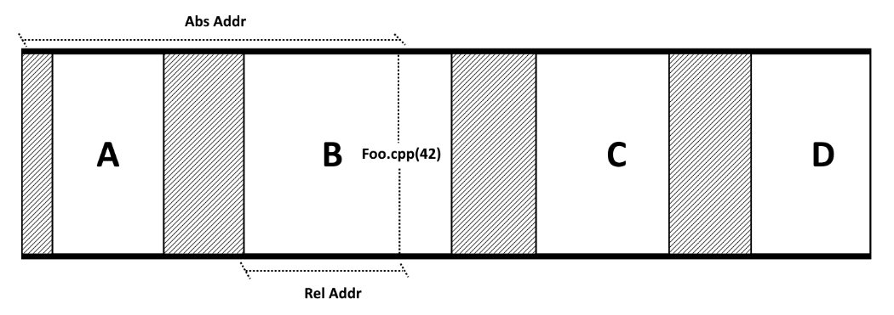

:information_source: Medium level

# Tutorial: efficient call-stack tracking

>**Remember** from the [previous tutorial](https://github.com/galtza/tutorial-callstack#conclusions) that *Call Stacks* are just a series of return addresses and they are used to transfer the control to/from subroutines.

When it comes to tracing the behaviour of a program *Call Stacks* are essential. **Debuggers** show us _Call Stacks_ as a breakpoint is hit, **Exception handling** code use _Call Stacks_ for providing the user with as much information as possible, in some frameworks **assertions** use *Call Stacks* to give context, etc. In summary, there are many known situations where using *Call Stacks* is useful.

However, they way we usually collect and interpret this information could be **more efficient** and somehow it limits our possibilities. We wrongly fall into believing that there is only one way to interpret a *Call Stack*.

In this tutorial we will be describing how to make *Call Stack* snapshots and interpret them in a way that allow us to widen our usage cases. It is **oriented to Windows** but all the principles are valid for all other OS. At the end of the tutorial there is a section that will guide us into adapting the presented techniques to **other OS**.

## The crux of the matter!

>Also from the [Call Stack tutorial](https://github.com/galtza/tutorial-callstack#conclusions) we need to remember that “*compilers expose the correspondence between source code and assembly code*”. 

This debug information is usually stored in the *.pdb* file associated to the *.exe* and it allows us to get the source file and the line given a memory address.

As this operation can be rather costly and present some limitations that we will see later, <ins>the crux of the whole matter</ins> is **WHEN** to perform it.

Usually, applications capture the *Call Stack* and interpret the memory addresses straightaway by using the compiler-generated debug information. This is, they use the [*DbgHelp*](https://learn.microsoft.com/en-us/windows/win32/api/dbghelp/) library to translate each address into source file / line. We need to know that this is fine for some use cases but it can be a real show stopper in some others due to the **performance cost** and in some cases as well the **multi-threading limitations** of the [*DbgHelp*](https://learn.microsoft.com/en-us/windows/win32/api/dbghelp/) library.

So, rather than interpreting the _Call Stack_ in the host app it is usually better to do it **via an externa application**. This way our host application is free to continue executing when that makes sense (not after a crash obviously).

## The problem

You might be asking yourself _”**why** does **not** everyone translate Call Stacks externally?”_

There are real challenges with this approach that we will explain and solve in this tutorial. However, and this is more a speculative attempt to explain the mind of programmers, there is a very human tendency to operate under imitation vs **reasoning under first principles**. This means that sometimes we just accept that something is not feasible just because we have never seen anyone doing it, hence, it is reasonable to keep on doing the old way. We are about to break that wall in this tutorial!

Focusing on the factual challenges, why is it more complex? We will get into the details in the next section but essentially it requires to **track down** some **process** related **information** in order to be able to make sense out of the raw memory addresses of the *Call Stack*.

In order to understand further the real problem we need to briefly dive into how a process is organized when it comes to memory.

## How a process is organised

As we just said, a *Call Stack* is made out of memory addresses. What is stored in those memory addresses is the code our program executes. But how is this **memory** really **organised** inside a process? 

Briefly, as this is not the aim of this tutorial: in Windows, a process is made out of at least one [module](https://learn.microsoft.com/en-us/windows/win32/psapi/module-information) (The _.exe_). A module is comprised of an **address and a size** and every single memory address in a *Call Stack* belongs to one and only one module.

Let's imagine a process with 4 modules: _**A**_, _**B**_, _**C**_ and _**D**_. In the picture we represent the process memory space range (*0*, *N-1*) and visually each module as a white box.

In the picture we refer to the file / line _**Foo.cpp(42)**_. This corresponds to a particular memory address inside the process (_Abs Addr_) and a relative address with respect to the module it belongs to (_Rel Addr_ respect to _**B**_). The question now is, which address do we need to store in order to be able to reconstruct the link between the address and the file / line?

Before we answer, notice the **gaps** between modules. This is the scenario we will find in most cases. The reason is that modules can be loaded and unloaded dynamically. If we inspect the application modules offline, that will be the scenario as well: the [*DbgHelp*](https://learn.microsoft.com/en-us/windows/win32/api/dbghelp/) library will load and unload on demand creating a different module layout in memory.

Precisely for this reason ultimately we need the relative addresses.

## The "legacy" way

Before we design the "new" system, let's take a look at what is currently done!

As we mentioned before, one of the most **common cases** is when an exception is raised in our application. There are two ways to access the _call stack_:

1. By using the function ***[StackWalk64](https://learn.microsoft.com/en-us/windows/win32/api/dbghelp/nf-dbghelp-stackwalk64)***

   Given a *[CONTEXT](https://learn.microsoft.com/en-us/windows/win32/api/winnt/ns-winnt-arm64_nt_context)* (from the exception information as in *[EXCEPTION_POINTERS](https://learn.microsoft.com/en-us/windows/win32/api/winnt/ns-winnt-exception_pointers)* or from the function *[RtlCaptureContext](https://learn.microsoft.com/en-us/windows/win32/api/winnt/nf-winnt-rtlcapturecontext)*), StackWalk64 will return information of the next entry in the _call stack_. 

2. By directly accessing the _Call Stack_ via ***[CaptureStackBackTrace](https://learn.microsoft.com/en-us/windows/win32/debug/capturestackbacktrace)*** and then using functions such as 

   Unlike *StackWalk64*, this retrieves up to a certain number of entries (called depth) at once. 

In all cases, we need to use the functions in [*DbgHelp*](https://learn.microsoft.com/en-us/windows/win32/api/dbghelp/) library that will allow us to translate addresses into symbols, lines, etc. 

Rather simple, uh?

## System design: let's take action!

So, it is the time to present the "new" system design. We will follow a very **simple principle** which is, "**minimise the computations** on the host application!". This means that if there is data that we can deduce offline we should not compute it on the host. This will allow us to increase the use cases or instances with the same performance budget.

In 10 steps, this is the **rough system design**:

|      |           |                                                              |
| ---- | --------- | ------------------------------------------------------------ |
| 1    | Timestamp | All events are **timestamped**. This is required as there can be modules sharing the same address space at different times and we need to identify which one belongs to which _call stack_ |
| 2    | Streams   | The system allows to create streams at any time. The streams can be anything from **files, sockets, etc** |
| 3    | *Init*    | During **initialization**, the <u>Host</u> **scans modules** and sends descriptor to streams. The data is: _name_, _path_, _checksum_, _base address_, _size_, etc |
| 4    | *Run*     | The <u>Host</u> tracks down all the **load module events** and sends their descriptors to the streams. (check out [this other tutorial](https://github.com/galtza/tutorial-dll-tracker) on how to track down *dll* events) |
| 5    | Hot join  | All **module events are special** and are sent over upon new stream. This is essential because it is used to translate absolute to relative addresses |
| 6    | Capture   | The _Host_ captures **_call stacks_ and sends them raw** to the streams. The viewer will transform it in order to extract information |
| 7    | Viewer    | The Viewer reads and **interprets streams** according to events. Additionally, it can transform finished streams into more "cooked" content for performance reasons |
| 8    | Database  | The module events generate a **database of module** descriptors which will be used by *Call Stack* events. |
| 9    | Addresses | Each **_call stack_ event is transformed** to relative addresses based on the module database and added the module identifier. |
| 10   | Translate | Each **relative memory address along with the module identifier** can be used directly to retrieve the source file and line. |

## Implementation details

asd

## Other OS

asd

## Conclusions

