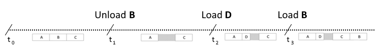

:information_source: Medium level

# Tutorial: efficient call-stack tracking

>**Remember** from the [previous tutorial](https://github.com/galtza/tutorial-callstack#conclusions) that call stacks are basically a series of return addresses and they are used in the process of transfering the control to/from subroutines.

Call stacks are not only useful for debugging, they are also commonly used in other situations to provide more context. For example, when an exception occurs, call stacks allow us to identify the source of the crash or they can be used in assertions as well. However, the current methods for collecting and interpreting call stack information can be improved, as they lack performance and limit our possibilities.

In this tutorial, we will cover techniques for capturing call stack snapshots efficiently and interpreting them. The tutorial will **focus on Windows**, but the principles discussed can be applied to other operating systems. At the end of the tutorial, we will provide guidance on how to adapt these techniques for use on **other operating systems**.

## The crux of the matter!

>As we learned in the [previous tutorial on call stacks](https://github.com/galtza/tutorial-callstack#conclusions) “*Compilers can store the mapping between source code and assembly which allows us to convert any code memory address into filename/line*”. 

This information is typically stored in the corresponding *.pdb* file associated with the *.exe*.

While it's common for applications to capture the call stack and immediately interpret each memory address using tools such as [*DbgHelp*](https://learn.microsoft.com/en-us/windows/win32/api/dbghelp/), this approach can be costly and has limitations, such as only being able to resolve addresses on one thread.

In most cases, it may be more efficient to interpret the call stack **externally**, in a separate application, as this allows for more flexibility in how the information is used.

## The challenge

You might be wondering why not everyone interprets call stacks externally.

There are technical challenges with this approach that we will be explaining and solving in this tutorial. However, one reason may be that some programmers tend to follow established practices instead of thinking critically and approaching the problem from first principles.

From a technical standpoint, interpreting the call stack externally is more complex because it requires gathering specific information about the process in order to understand the raw memory addresses of the call stack. Before we continue, let's delve into how code is organized within a process.

## How a process is organised

When we capture a snapshot of the call stack, we are left with a series of memory addresses that point to different parts of our program code. In order to determine which source files each of the addresses correspond to, it's important to understand how a process is organized in memory.

A process is composed of several modules, also referred to as shared libraries or dynamic-link libraries. These modules contain code and data, and are mapped into the process's virtual memory space at specific ranges. In Windows, modules are typically represented by files with the extensions *.exe* or *.dll*. Every memory address in our call stack belongs to one of these memory ranges.

For example, imagine a situation where a process has 4 loaded modules: **A**, **B**, **C**, and **D**. The illustration below depicts the process memory space range from *0* to *n-1* along with the arbitrary absolute addresses **X** and **Y** represented by the green dots.


The modules within a process may not be arranged in a contiguous memory layout, as demonstrated by the dashed area in the illustration. This is a result of their dynamic nature; a module can be loaded and unloaded multiple times during the lifecycle of a process.

In this specific example, the three modules **A**, **B** and **C** could have been loaded in a way that they are arranged sequentially in the memory. At a specific time **t<sub>0</sub>** we captured a call stack that includes an absolute address **X**. At this precise time, **X** belongs to the memory range of module **B**.



At a later time, **t<sub>1</sub>**, the process unloads module **B** and at **t<sub>2</sub>**, it loads module **D** in the same location where **B** used to reside. We then capture another call stack that includes the same **X** absolute address. However, this time, the new address no longer belongs to module **B**; it now belongs to module **D**.

Lastly, at **t<sub>3</sub>**, the original **B** module is reloaded, but at a different address this time. Again, we capture yet another call stack, and we find an arbitrary address **Y**. At this time, **Y** corresponds to the module **B**.

It is worth noting that **X** had different associated modules during the time periods **t<sub>0</sub>**-**t<sub>1</sub>** and **t<sub>2</sub>**-**t<sub>3</sub>**, with no associated module present during the period **t<sub>1</sub>**-**t<sub>2</sub>**. The same concept applies to the address **Y**.

To summarize, the dynamic and temporal nature of modules highlights two crucial conclusions:

1. All of our events should be timestamped.
2. We must work with relative addresses rather than absolute addresses.


## The "legacy" way

Currently, there are two main ways to retrieve and interpret a call stack. 

The first method is to use the function ***[StackWalk64](https://learn.microsoft.com/en-us/windows/win32/api/dbghelp/nf-dbghelp-stackwalk64)***. This function takes in a *[CONTEXT](https://learn.microsoft.com/en-us/windows/win32/api/winnt/ns-winnt-arm64_nt_context)* (such as from the exception information in *[EXCEPTION_POINTERS](https://learn.microsoft.com/en-us/windows/win32/api/winnt/ns-winnt-exception_pointers)* or from the function *[RtlCaptureContext](https://learn.microsoft.com/en-us/windows/win32/api/winnt/nf-winnt-rtlcapturecontext)*) and returns information about the next entry in the call stack.

The second method is to directly access the call stack using ***[CaptureStackBackTrace](https://learn.microsoft.com/en-us/windows/win32/debug/capturestackbacktrace)***. This retrieves a certain number of entries at once, known as the depth.

In both cases, we need to use functions from the [*DbgHelp*](https://learn.microsoft.com/en-us/windows/win32/api/dbghelp/) library such as *SymGetLineFromAddrW64* or *SymFromAddrW* to interpret the call stack.

## The “new” approach

Our new approach is straightforward and employs a distinct **host** and **viewer** application. The host application monitors changes in the process modules and records raw call stacks, while the viewer application interprets the gathered data. Our goal is to minimize intrusion, thus keeping the performance impact on the **host** to a minimum.

## The Host

Before we can capture any call stacks, the host application must first undertake two important steps: (i) **begin monitoring** the load and unload events of modules, and (ii) take a snapshot of the **currently loaded modules**. Starting with module monitoring is crucial as modules can be loaded from different threads. If the snapshot were taken first, there would be a risk of losing important information. By beginning with module monitoring, the host application can ensure that it captures all relevant data.

We have created a class named *recorder_t* which includes all necessary functionality for tracking modules, taking snapshots, and capturing call stacks. Inside this class, the function responsible for executing these two steps is called *bootstrap* and can be found in the file *callstack-recorder.cpp*.

```c++
void qcstudio::callstack::recorder_t::bootstrap() {
    // As the recorder recorder instance is a static variable it will be zero-initialized,
    // hence, we can assume that nullptr means not initialized
    // (https://en.cppreference.com/w/cpp/language/initialization#Static_initialization)

    if (!buffer_) {
        buffer_ = (uint8_t*)malloc(BUFFER_SIZE);  // make use of malloc in order to avoid potential "new operator" overrides
        cursor_ = 0;

        // Enumerate the modules and register for tracking events

        start_tracking_modules();
        enum_modules();
    }
}
```

This function is crucial as it allows for lazy initialization of the recorder which is necessary to avoid the C++ [Static Initialization Order Fiasco](https://en.cppreference.com/w/cpp/language/siof). This function is invoked every time we call the *capture* function, ensuring that the recorder is properly initialized before being used.

Inside the *bootstrap* function, there are the *start_tracking_modules* and *enum_modules* functions that correspond to steps (i) and (ii) mentioned earlier. The *start_tracking_modules* function is responsible for monitoring the loading and unloading of modules, and the *enum_modules* function is responsible for capturing a snapshot of the currently loaded modules.

The basic principles of the *start_tracking_modules* function are explained in detail in [this tutorial](https://github.com/galtza/tutorial-dll-tracker). The *enum_modules* function makes use of the Windows function *EnumProcessModulesEx* to enumerate the modules and retrieve their information:

```c++
auto qcstudio::callstack::recorder_t::enum_modules() -> bool {
    // First call to get the total number of modules available

    auto bytes_required = DWORD{};
    if (!EnumProcessModulesEx(GetCurrentProcess(), NULL, 0, &bytes_required, LIST_MODULES_ALL)) {
        return false;
    }

    // Alloc space to hold all the modules

    auto ok = false;
    if (auto buffer = (LPBYTE)LocalAlloc(LMEM_FIXED | LMEM_ZEROINIT, bytes_required)) {
        auto  module_array = (HMODULE*)buffer;
        WCHAR module_path[1024];

        ok = true;  // Assume we will succeed
        if (EnumProcessModules(GetCurrentProcess(), module_array, bytes_required, &bytes_required)) {
            auto num_modules = bytes_required / sizeof(HMODULE);
            for (auto i = 0u; i < num_modules; ++i) {
                auto module_info = MODULEINFO{};
                if (GetModuleInformation(GetCurrentProcess(), module_array[i], &module_info, sizeof(module_info))) {
                    GetModuleFileNameW(module_array[i], module_path, 1024);
                    on_add_module(module_path, reinterpret_cast<uintptr_t>(module_info.lpBaseOfDll), module_info.SizeOfImage);
                } else {
                    ok = false;
                }
            }
        } else {
            ok = false;
        }

        LocalFree(buffer);
    }

    return ok;
}
```

The *EnumProcessModules* function is called twice in our implementation. The first time it is used to calculate the amount of memory required to store all the module information, and the second time it is used to retrieve the actual module data. This approach allows for efficient memory management and storage of all module information.

In the *on_add_module* function, we extract the relevant information for each module, including the module's file path, base address, and size. This information is crucial for later reconstructing call stack entries.

Once the host application is set up, it can begin capturing call stacks using the function *RtlCaptureStackBackTrace*. The code for this can be seen in the function *[capture](https://github.com/galtza/tutorial-callstack-tracker/blob/main/src/qcstudio/callstack-recorder-windows.cpp#L144)* in the file *callstack-recorder-windows.cpp*:

```c++
void qcstudio::callstack::recorder_t::capture() {
    bootstrap();

    auto guard     = std::lock_guard(lock_);
    auto buffer    = array<void*, 200>{};
    auto num_addrs = RtlCaptureStackBackTrace(1, (DWORD)buffer.size(), buffer.data(), nullptr);
    auto timestamp = duration_cast<nanoseconds>(system_clock::now().time_since_epoch()).count();

    write(event::callstack);
    write(timestamp);
    write((uint16_t)num_addrs);                                 // 2 bytes
    write((uint8_t*)buffer.data(), num_addrs * sizeof(void*));  // n bytes (#addrs * size_of_addr)
}
```

Note that the first parameter in the call to *RtlCaptureStackBackTrace* is set to 1, which means that the first item in the stack is skipped. This is because the capturing function is usually part of the call stack and we don't want it to be included.

In our example recorder, we are saving all the recorded information in a buffer, which will be written to a file at a later time, and read by the viewer application.

## The Viewer

The viewer must effectively utilize all the information collected from the **host** to accurately re-create the conditions in which the call stack was recorded. It's crucial to keep in mind that all the events are timestamped and comprise:

- Module load events (base address, size, and path)
- Module unload events (path)
- Call stack capture events (list of absolute addresses)

This information is sufficient to reconstruct the recording conditions and can be processed in various ways.

On one hand, we could pre-process the recording by converting all absolute addresses into their relative versions. This approach allows for easy, fast and straightforward interpretation. On the other hand, we could simulate the recording by playing back the events in linear fashion. We choose the second approach as it is the simplest for the purpose of this tutorial.

***

Speaking about implementation, in Windows, we must make use of the Debug Help Library (dbghelp.dll). This library requires some basic setup, which can be found in the function *start* in the file *callstack-player.cpp*.

```c++
// Init the DbgHelp library

/*
    == DebgHelp setup ==========
    Init the library
    Generate a random id to be used on evary Sym* call
*/
auto old_opt = SymGetOptions();
auto opt =
    (old_opt & ~SYMOPT_DEFERRED_LOADS)  // Load symbols as we load the module
    | SYMOPT_LOAD_LINES                 // We will be needing the source lines
    | SYMOPT_IGNORE_NT_SYMPATH          // Ignore _NT_SYMBOL_PATH
    | SYMOPT_UNDNAME                    // Human readable non-decorated names
    /* | SYMOPT_DEBUG */
    ;
SymSetOptions(opt);

id_ = generate_id();
if (!SymInitialize((HANDLE)id_, NULL, FALSE)) {
    return false;
}
```

Notice that according to the [documentation](https://learn.microsoft.com/en-us/windows/win32/api/dbghelp/nf-dbghelp-syminitialize) the first parameter passed to *SymInitialize* "*should be unique and nonzero, but need not be a process handle*". We generate an id with the function *generate_id* which will be unique every time we execute the viewer.

***

It is important to understand the two interrelated tasks being performed in the loop of the `start` function. We are reconstructing the reality of the recording and resolving the call stack simultaneously.

The struct `module_info_t` defines the information required to be stored per module for the two tasks previously mentioned:

```c++
struct module_info_t {
    wstring   path;
    uintptr_t recording_base_addr, actual_base_addr;
    size_t    size;
};
```

The data structure we use to store this information is a map, where the key is the module's original recording range and the value is an instance of `module_info_t`.

```c++
using range_t = pair<uintptr_t, uintptr_t>;
auto cmp      = [](const range_t& _left, const range_t& _right) {
    return _left.second < _right.first;
};
auto loaded_modules = map<range_t, module_info_t, decltype(cmp)>(cmp);
```

We use a lambda function to compare two ranges in the map, which helps us locate modules given a particular absolute address.

When we read an `add_module` event, we retrieve the `path` and `size` and perform the following actions:

```c++
if (auto opt_actual_base_addr = load_module(path, size)) {
    const auto addr_range      = range_t{org_base_addr, org_base_addr + size - 1};
    loaded_modules[addr_range] = module_info_t{
        path,
        org_base_addr,
        *opt_actual_base_addr,
        size,
    };
}
```

> Note that the `load_module` and `read_add_module` functions are not crucial to understanding the basic loop's functionality and will be explained later.

The following code processes three steps to handle call stack events:

1. Reading the recording status at the current time.
2. Loading the module.
3. Storing both the recording status and the current status in a map.

By the time a call stack event is read, all necessary data will be prepared and ready to use.

```c++
for (auto abs_addr : read_callstack(file)) {
    const auto endit = loaded_modules.end();
    if (auto it_module = loaded_modules.find({abs_addr, abs_addr}); it_module != endit) {
        auto offset               = abs_addr - it_module->second.recording_base_addr;
        auto [file, line, symbol] = resolve(it_module->second.actual_base_addr, offset);
        cout << file << "(" << line << "): " << symbol;
    }
}
```

The following steps are followed to resolve an address:

1. Read the call stack and iterate through the absolute addresses.
2. Search for the absolute address in the current module map.
3. If found, calculate the offset relative to the module.
4. Perform the resolution of the address.

The `resolve` function, as outlined below, is the final implementation step in this process:

```c++
auto qcstudio::callstack::player_t::resolve(uint64_t _baseaddr, uint64_t _addroffset)
    -> tuple<wstring, int, wstring> {
    auto index = DWORD64{};
    struct {
        SYMBOL_INFOW  sym;
        unsigned char name[256];
    } user_symbol;
    user_symbol.sym.SizeOfStruct = sizeof(user_symbol.sym);
    user_symbol.sym.MaxNameLen   = sizeof(user_symbol.name);
    auto addr                    = (DWORD64)(_baseaddr + _addroffset);
    if (SymFromAddrW((HANDLE)id_, addr, &index, &user_symbol.sym)) {
        auto line         = IMAGEHLP_LINEW64{};
        auto offset       = DWORD{0};
        line.SizeOfStruct = sizeof(line);
        if (SymGetLineFromAddrW64((HANDLE)id_, addr, &offset, &line)) {
            return {line.FileName, line.LineNumber, wstring(user_symbol.sym.Name)};
        } else {
            return {L"", -1, wstring(user_symbol.sym.Name)};
        }
    }
    return {};
}
```

We use two functions from the Debug Help Library: *[SymFromAddrW](https://learn.microsoft.com/en-us/windows/win32/api/dbghelp/nf-dbghelp-symfromaddrw)* and *[SymGetLineFromAddrW64](https://docs.microsoft.com/en-us/windows/win32/api/dbghelp/nf-dbghelp-symgetlinefromaddrw64)* , both in the wide character version as we need to support Unicode.

Please note that even if `SymGetLineFromAddrW64` fails, we still want to use the symbol information.

***

In addition to the previously mentioned functions, there are other functions that we use to read the stream of events. These include:

- `read_event` which reads the event type and timestamp.
- `read_add_module` for reading the module path and size when a module is added.
- `read_del_module` for reading the module path when a module is removed.
- `read_callstack` for reading all the absolute addresses of a call stack.

## Try the code

To test this repository, you will need **premake5** and **VS2019**. The Visual Studio version can be easily changed by editing the *generate.bat* file. The solution files are located in the `.build` folder, temporary files can be found in `.tmp`, and the output binary files are located in `.out`.

Once the solution has been generated and opened in Visual Studio, the first step is to run the *host* command line project, which will generate the event data. If successful, it will display the message "Done!". Next, execute the *viewer* project to interpret the recorded events and display the results.


A possible output of the *viewer* could be:

```terminal
04/08/18 20:05:44: {
    "foo.dll"! C:\Users\555\repos\tutorial-callstack-tracker\src\foo\foo测试.cpp(56): foo_func_2
    "foo.dll"! C:\Users\555\repos\tutorial-callstack-tracker\src\foo\foo测试.cpp(61): foo_func_1
    "foo.dll"! C:\Users\555\repos\tutorial-callstack-tracker\src\foo\foo测试.cpp(65): foo
    "host.exe"! C:\Users\555\repos\tutorial-callstack-tracker\src\host\host.cpp(45): main
    "host.exe"! D:\a\_work\1\s\src\vctools\crt\vcstartup\src\startup\exe_common.inl(79): invoke_main
    "host.exe"! D:\a\_work\1\s\src\vctools\crt\vcstartup\src\startup\exe_common.inl(288): __scrt_common_main_seh
    "host.exe"! D:\a\_work\1\s\src\vctools\crt\vcstartup\src\startup\exe_common.inl(331): __scrt_common_main
    "host.exe"! D:\a\_work\1\s\src\vctools\crt\vcstartup\src\startup\exe_main.cpp(17): mainCRTStartup
    "KERNEL32.DLL"! 0x7ffc69537614: BaseThreadInitThunk
    "ntdll.dll"! 0x7ffc6a0426a1: RtlUserThreadStart
}
04/08/18 20:05:51: {
    "bar.dll"! C:\Users\555\repos\tutorial-callstack-tracker\src\bar\bar.cpp(30): bar_func_3
    "bar.dll"! C:\Users\555\repos\tutorial-callstack-tracker\src\bar\bar.cpp(35): bar_func_2
    "bar.dll"! C:\Users\555\repos\tutorial-callstack-tracker\src\bar\bar.cpp(39): bar_func_1
    "bar.dll"! C:\Users\555\repos\tutorial-callstack-tracker\src\bar\bar.cpp(43): bar
    "foo.dll"! C:\Users\555\repos\tutorial-callstack-tracker\src\foo\foo测试.cpp(50): foo_func_3
    "foo.dll"! C:\Users\555\repos\tutorial-callstack-tracker\src\foo\foo测试.cpp(57): foo_func_2
    "foo.dll"! C:\Users\555\repos\tutorial-callstack-tracker\src\foo\foo测试.cpp(61): foo_func_1
    "foo.dll"! C:\Users\555\repos\tutorial-callstack-tracker\src\foo\foo测试.cpp(65): foo
    "host.exe"! C:\Users\555\repos\tutorial-callstack-tracker\src\host\host.cpp(45): main
    "host.exe"! D:\a\_work\1\s\src\vctools\crt\vcstartup\src\startup\exe_common.inl(79): invoke_main
    "host.exe"! D:\a\_work\1\s\src\vctools\crt\vcstartup\src\startup\exe_common.inl(288): __scrt_common_main_seh
    "host.exe"! D:\a\_work\1\s\src\vctools\crt\vcstartup\src\startup\exe_common.inl(331): __scrt_common_main
    "host.exe"! D:\a\_work\1\s\src\vctools\crt\vcstartup\src\startup\exe_main.cpp(17): mainCRTStartup
    "KERNEL32.DLL"! 0x7ffc69537614: BaseThreadInitThunk
    "ntdll.dll"! 0x7ffc6a0426a1: RtlUserThreadStart
}
04/08/18 20:06:00: {
    "host.exe"! C:\Users\555\repos\tutorial-callstack-tracker\src\host\host.cpp(49): main
    "host.exe"! D:\a\_work\1\s\src\vctools\crt\vcstartup\src\startup\exe_common.inl(79): invoke_main
    "host.exe"! D:\a\_work\1\s\src\vctools\crt\vcstartup\src\startup\exe_common.inl(288): __scrt_common_main_seh
    "host.exe"! D:\a\_work\1\s\src\vctools\crt\vcstartup\src\startup\exe_common.inl(331): __scrt_common_main
    "host.exe"! D:\a\_work\1\s\src\vctools\crt\vcstartup\src\startup\exe_main.cpp(17): mainCRTStartup
    "KERNEL32.DLL"! 0x7ffc69537614: BaseThreadInitThunk
    "ntdll.dll"! 0x7ffc6a0426a1: RtlUserThreadStart
}
04/08/18 20:06:07: {
    "bar.dll"! C:\Users\555\repos\tutorial-callstack-tracker\src\bar\bar.cpp(30): bar_func_3
    "bar.dll"! C:\Users\555\repos\tutorial-callstack-tracker\src\bar\bar.cpp(35): bar_func_2
    "bar.dll"! C:\Users\555\repos\tutorial-callstack-tracker\src\bar\bar.cpp(39): bar_func_1
    "bar.dll"! C:\Users\555\repos\tutorial-callstack-tracker\src\bar\bar.cpp(43): bar
    "host.exe"! C:\Users\555\repos\tutorial-callstack-tracker\src\host\host.cpp(53): main
    "host.exe"! D:\a\_work\1\s\src\vctools\crt\vcstartup\src\startup\exe_common.inl(79): invoke_main
    "host.exe"! D:\a\_work\1\s\src\vctools\crt\vcstartup\src\startup\exe_common.inl(288): __scrt_common_main_seh
    "host.exe"! D:\a\_work\1\s\src\vctools\crt\vcstartup\src\startup\exe_common.inl(331): __scrt_common_main
    "host.exe"! D:\a\_work\1\s\src\vctools\crt\vcstartup\src\startup\exe_main.cpp(17): mainCRTStartup
    "KERNEL32.DLL"! 0x7ffc69537614: BaseThreadInitThunk
    "ntdll.dll"! 0x7ffc6a0426a1: RtlUserThreadStart
}
```


## Other Operating Systems

The concept of a module is an essential aspect of software development that allows for the division of a program into smaller, more manageable parts. This concept is similar across different operating systems, such as Windows and Linux.

In Windows, we can load and unload library modules using the functions [LoadLibrary](https://learn.microsoft.com/en-us/windows/win32/api/libloaderapi/nf-libloaderapi-loadlibrarya) and [FreeLibrary](https://learn.microsoft.com/en-us/windows/win32/api/libloaderapi/nf-libloaderapi-freelibrary). On the other hand, in Linux, the equivalent functions for loading and unloading modules are [dlopen](https://man7.org/linux/man-pages/man3/dlopen.3.html) and [dlclose](https://man7.org/linux/man-pages/man3/dlclose.3.html).

When it comes to resolving addresses, Windows provides functions like [SymGetLineFromAddrW64](https://learn.microsoft.com/en-us/windows/win32/api/dbghelp/nf-dbghelp-symgetlinefromaddrw64) while in Linux, the equivalent function is [dladdr](https://man7.org/linux/man-pages/man3/dladdr.3.html).

In Unix and Linux systems, tracking changes in loaded modules is not as straightforward as in Windows, where functions such as [LdrRegisterDllNotification](https://learn.microsoft.com/en-us/windows/win32/devnotes/ldrregisterdllnotification) and [LdrUnregisterDllNotification](https://learn.microsoft.com/en-us/windows/win32/devnotes/ldrunregisterdllnotification) are available. An alternative approach in Linux is to use the [procfs](https://es.wikipedia.org/wiki/Procfs), a special file system that presents information about processes. By opening a particular file called `/proc/pid/maps` and invoking [poll](https://man7.org/linux/man-pages/man2/poll.2.html) or similar functions, notifications about changes can be obtained, then read the file and compare it with the previous version to spot the changes. This file contains information such as the memory range and the path to the shared object.

## Conclusions

Call stacks are a very convenient way of getting more context in many debugging situations. However, the way we currently collect and interpret the information is suboptimal. This limitation prevents us from building more sophisticated software that can aid in the development process.

By separating the process of collecting raw call stack information and events related to modules from the interpretation of that information, we can fully utilize the potential of these tools. 

The host will track down the raw call stack information in addition to all the events related to modules and timestamp all the information. 

Then, the viewer can recreate the same conditions as when the call stack was captured.

